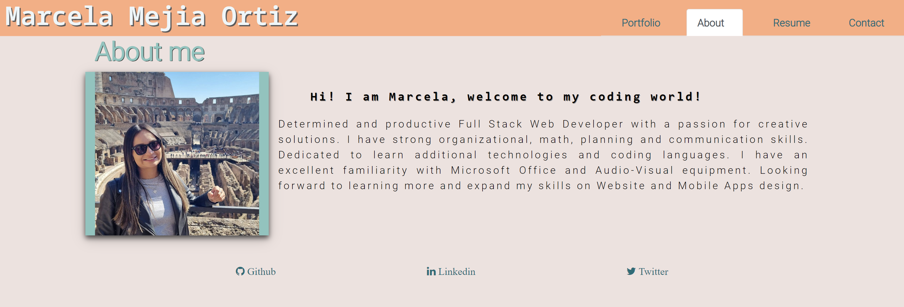
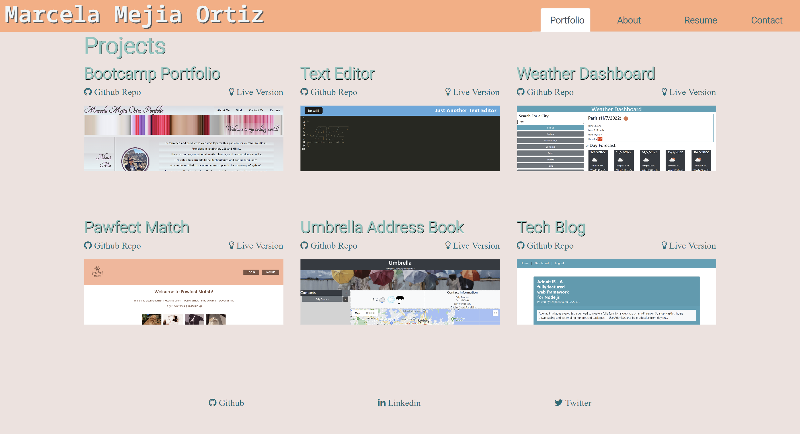

# **React Portfolio**

## **Table of Contents** 

- [**Description**](#description)
- [**Installation**](#installation)
- [**Usage**](#usage)
- [**Preview**](#preview)
- [**Deployed link**](#deployed-link)
- [**Questions**](#questions)


## **Description**

This project is built with React to create a professional portfolio using the React skills and  the latest technologies.

## **Installation**

```
npm install
```
```
npm run start
```

## **Usage**

* The portfolio is presented with a page containing a header, a section for content and a footer.
* The navigation titles are presented with the titles About, Portfolio, Contact and Resume.
* When the user clicks on the a navigation title they are presented with the corresponding section below the navigation without the page reloading and that title is highlighted.
* The first time that the portfolio page is loaded, the About title is selected by default.
* The About Me section contains a photo of the developer and a short bio.
* The Portfolio section contains titled images of six of the developer’s applications with links to both the deployed applications and the corresponding GitHub repositories.
* The Contact section contains a contact form with fields for a name, an email address, and a message. If the user moves the cursor out of one of the form fields without entering text they will receive a notification that this field is required. If the user enteres an invalid email, they are again presented with a notification stating tha the email is invalid.
* The Resume section contains a link to a downloadable resume and a list of the developer’s proficiencies.
* The footer is presented with icon links to the developer’s GitHub, LinkedIn and Twitter profiles. 


## **Preview**

 
 

## **Deployed link**

💡 Live version: [click here!](https://marcelamejiao.github.io/react-portfolio)

## **Questions**

[GitHub](https://github.com/marcelamejiao)

If you have additional questions, please email me at: marcelitamejia_24@hotmail.com